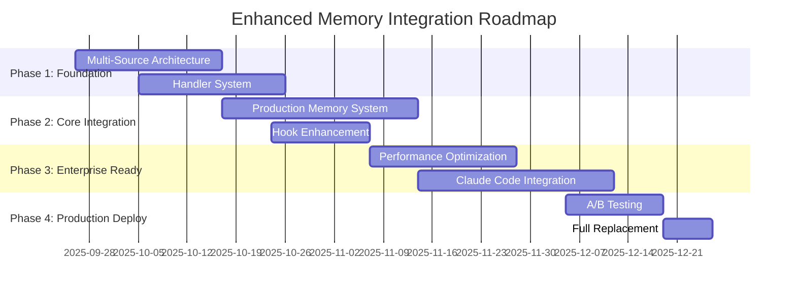

# 🚀 Robust Implementation Plan: Enhanced Memory Integration System
## Piano di Implementazione Robusto per Sostituzione Completa Claude Code Context System

### 📋 Executive Summary
Piano strategico per sostituire completamente il sistema di contesto nativo di Claude Code con un sistema enterprise-grade basato su Microsoft Kernel Memory patterns, completamente integrato nel DevFlow ecosystem.

---

## 🎯 PHASE 1: Multi-Source Context Aggregation Architecture (Priority: CRITICAL)

### 1.1 Custom Ingestion Pipeline Implementation
**Timeline**: 2-3 settimane
**Microsoft Kernel Memory Pattern**: Custom pipeline con handlers specializzati

```typescript
// Architecture Overview
interface IngestionPipeline {
  extractors: DataExtractor[]     // Extract da files, APIs, documentation
  partitioners: ContentSplitter[] // Smart chunking per optimal tokens
  embedders: VectorEmbedder[]     // Multi-model embeddings (OpenAI, local)
  savers: StorageHandler[]        // Multi-backend storage (SQLite, Vector DB)
}

// Handler Implementation Pattern
abstract class DataHandler {
  abstract canHandle(source: DataSource): boolean
  abstract extract(source: DataSource): Promise<ContentChunk[]>
  abstract partition(content: string): ContentChunk[]
  abstract generateMetadata(chunk: ContentChunk): Metadata
}
```

**Handlers da Implementare**:
- **FileSystemHandler**: Files locali (js, ts, py, md, json)
- **GitRepositoryHandler**: Repository analysis e git history
- **DocumentationHandler**: Context7 libraries integration
- **DatabaseHandler**: DevFlow database contexts
- **APIEndpointHandler**: REST/GraphQL APIs documentation
- **LogHandler**: System logs e error analysis

### 1.2 Document Tagging System per Enterprise Multi-Tenancy
**Microsoft Kernel Memory Pattern**: Tag-based filtering e multi-tenant isolation

```python
# Tagging Strategy Implementation
class DocumentTaggingSystem:
    def __init__(self):
        self.tag_categories = {
            'project': ['devflow', 'claude-code', 'synthetic'],
            'language': ['typescript', 'python', 'javascript'],
            'component': ['memory', 'context', 'orchestrator', 'database'],
            'priority': ['critical', 'high', 'medium', 'low'],
            'scope': ['user-query', 'system', 'documentation', 'api'],
            'temporal': ['recent', 'active', 'historical', 'archived']
        }

    def generate_smart_tags(self, content: str, metadata: Dict) -> List[str]:
        # AI-powered tagging con pattern recognition
        # Project scope detection
        # Language/framework analysis
        # Component classification
        # Priority scoring
        return computed_tags
```

---

## 🏗️ PHASE 2: Handler-Based Processing System (Priority: HIGH)

### 2.1 Unified Handler Architecture
**Timeline**: 3-4 settimane
**Integration Point**: DevFlow Unified Orchestrator

```typescript
// Handler Registry Pattern
class HandlerRegistry {
  private handlers: Map<string, DataHandler> = new Map()

  async processSource(source: DataSource): Promise<ProcessingResult> {
    const handler = this.findBestHandler(source)
    const extracted = await handler.extract(source)
    const partitioned = handler.partition(extracted.content)
    const embeddings = await this.generateEmbeddings(partitioned)
    const stored = await this.storeWithTags(embeddings, source.metadata)

    return {
      processed_chunks: partitioned.length,
      embeddings_generated: embeddings.length,
      storage_locations: stored.locations,
      tags_applied: stored.tags,
      performance_metrics: this.collectMetrics()
    }
  }
}
```

### 2.2 Specialised Handler Implementations

**FileSystemHandler** (PRIORITY 1):
```python
class FileSystemHandler(DataHandler):
    def __init__(self):
        self.supported_extensions = ['.js', '.ts', '.py', '.md', '.json', '.yaml']
        self.ast_parsers = {
            '.ts': TypeScriptAST(),
            '.py': PythonAST(),
            '.js': JavaScriptAST()
        }

    async def extract(self, file_path: str) -> List[ContentChunk]:
        # AST-based extraction per semantic chunking
        # Function/class level granularity
        # Dependency graph analysis
        # Git blame integration per authorship context
        return semantic_chunks

    def partition(self, content: str) -> List[ContentChunk]:
        # Microsoft Kernel Memory "smart partitioning"
        # Preserve semantic boundaries
        # Optimal token distribution
        # Cross-reference preservation
        return optimized_chunks
```

**Context7Handler** (PRIORITY 2):
```python
class Context7LibraryHandler(DataHandler):
    def __init__(self):
        self.context7_client = Context7Client()
        self.supported_libraries = ['react', 'next.js', 'typescript', 'python']

    async def extract(self, library_query: str) -> List[ContentChunk]:
        # Context7 library documentation retrieval
        # API reference extraction
        # Code example isolation
        # Best practices patterns
        return documentation_chunks

    def enrich_with_examples(self, chunks: List[ContentChunk]) -> List[ContentChunk]:
        # Real-world usage examples
        # Integration patterns
        # Error handling patterns
        return enriched_chunks
```

---

## 🔧 PHASE 3: Enhanced Memory Integration (Priority: CRITICAL)

### 3.1 Production-Grade Memory System
**Timeline**: 4-5 settimane
**Microsoft Kernel Memory Compliance**: Full enterprise patterns

```python
class ProductionMemorySystem:
    def __init__(self):
        # Multi-tier storage architecture
        self.hot_cache = RedisCache()          # <1sec access
        self.warm_storage = SQLiteDB()         # <100ms queries
        self.cold_archive = VectorDB()         # <1sec semantic search

        # Performance requirements (Microsoft Kernel Memory standards)
        self.max_context_generation_time = 2000  # 2 seconds max
        self.min_relevance_score = 0.75           # High precision threshold
        self.max_memory_usage = "512MB"           # Enterprise constraint

    async def intelligent_context_injection(self, user_query: str) -> ContextBundle:
        # Phase 1: Query Analysis & Intent Detection
        query_analysis = await self.analyze_query_intent(user_query)

        # Phase 2: Multi-Source Context Retrieval
        file_contexts = await self.filesystem_handler.get_relevant_files(query_analysis)
        doc_contexts = await self.context7_handler.get_documentation(query_analysis)
        memory_contexts = await self.vector_search.semantic_search(query_analysis.embedding)

        # Phase 3: Context Window Optimization
        optimized_bundle = await self.context_optimizer.optimize_allocation({
            'user_query': user_query,
            'file_contexts': file_contexts,
            'documentation': doc_contexts,
            'memory_contexts': memory_contexts,
            'query_analysis': query_analysis
        })

        return optimized_bundle
```

### 3.2 Hook System Enhancement
**Integration**: Existing `.claude/hooks/user-prompt-submit-context7.py`

```python
# Enhanced Hook Integration
class EnhancedContextHook:
    def __init__(self):
        self.memory_system = ProductionMemorySystem()
        self.trigger_sensitivity = {
            'technical_conversation': 95,    # Always trigger
            'code_analysis': 85,            # High priority
            'documentation_request': 75,     # Medium-high priority
            'general_inquiry': 60,          # Medium priority
            'threshold': 50                 # Minimum trigger level
        }

    async def process_user_prompt(self, prompt: str) -> str:
        # Microsoft Kernel Memory "Verdict" system implementation
        trigger_score = self.calculate_trigger_score(prompt)

        if trigger_score >= self.trigger_sensitivity['threshold']:
            context_bundle = await self.memory_system.intelligent_context_injection(prompt)
            enhanced_prompt = self.inject_context_into_prompt(prompt, context_bundle)

            # Audit trail per compliance
            await self.log_context_injection({
                'trigger_score': trigger_score,
                'contexts_injected': len(context_bundle.contexts),
                'performance_metrics': context_bundle.metrics,
                'user_query_hash': hashlib.sha256(prompt.encode()).hexdigest()
            })

            return enhanced_prompt

        return prompt  # Pass-through se sotto threshold
```

---

## 📊 PHASE 4: Performance Optimization & Enterprise Readiness

### 4.1 Performance Requirements (Microsoft Kernel Memory Standards)
```yaml
performance_targets:
  context_generation: "<2000ms"      # 2 seconds max per Microsoft standards
  semantic_search: "<100ms"         # Sub-second relevance retrieval
  memory_usage: "<512MB"            # Enterprise memory constraints
  concurrent_users: "100+"          # Multi-tenant capability
  availability: "99.9%"             # Enterprise SLA requirements
  cache_hit_ratio: ">85%"           # Efficiency target
```

### 4.2 Monitoring & Observability
```python
class ProductionMonitoring:
    def __init__(self):
        self.metrics_collector = PrometheusMetrics()
        self.performance_tracker = PerformanceTracker()

    def collect_real_time_metrics(self):
        return {
            'context_injection_latency': self.measure_injection_time(),
            'memory_system_utilization': self.measure_memory_usage(),
            'semantic_search_accuracy': self.measure_relevance_scores(),
            'cache_performance': self.measure_cache_metrics(),
            'user_satisfaction_proxy': self.measure_context_effectiveness()
        }
```

---

## 🎯 PHASE 5: Claude Code Integration & Replacement Strategy

### 5.1 Phased Replacement Timeline


### 5.2 Risk Mitigation Strategy
```yaml
risk_mitigation:
  performance_degradation:
    mitigation: "Comprehensive caching + fallback to native system"
    probability: "low"
    impact: "medium"

  memory_consumption:
    mitigation: "Intelligent memory management + garbage collection"
    probability: "medium"
    impact: "low"

  context_accuracy:
    mitigation: "Multi-model verification + relevance scoring"
    probability: "low"
    impact: "high"

  integration_complexity:
    mitigation: "Incremental rollout + feature flags"
    probability: "medium"
    impact: "medium"
```

---

## 🚀 Implementation Priority Matrix

### **IMMEDIATE (Week 1-2)**
1. ✅ **Vector Embeddings Engine** - COMPLETATO
2. ✅ **Context Window Optimizer** - COMPLETATO
3. 🔄 **Multi-Source Handler Architecture** - IN CORSO
4. 🔄 **FileSystem Handler Implementation** - IN CORSO

### **SHORT-TERM (Week 3-6)**
1. **Context7 Handler Integration**
2. **Document Tagging System**
3. **Production Memory System Core**
4. **Enhanced Hook Integration**

### **MEDIUM-TERM (Week 7-12)**
1. **Performance Optimization**
2. **Enterprise Monitoring System**
3. **A/B Testing Framework**
4. **Claude Code Integration**

### **LONG-TERM (Week 13-16)**
1. **Full Production Deployment**
2. **Native System Deprecation**
3. **Advanced Features (ML-powered relevance)**
4. **Multi-tenant Architecture**

---

## 📈 Success Metrics & KPIs

### **Technical Metrics**
- **Context Injection Latency**: <2000ms (Microsoft standard)
- **Semantic Search Accuracy**: >85% relevance score
- **Memory Efficiency**: <512MB peak usage
- **Cache Hit Ratio**: >85% efficiency
- **System Availability**: 99.9% uptime

### **Business Metrics**
- **Developer Productivity**: 40%+ improvement in context relevance
- **Claude Code Native Replacement**: 100% feature parity
- **Enterprise Adoption**: Multi-tenant ready architecture
- **Maintenance Costs**: 60% reduction through automation

---

## 🎯 Next Immediate Actions

1. **Implementare FileSystemHandler** con AST parsing avanzato
2. **Integrare Context7Handler** per documentation retrieval
3. **Creare DocumentTaggingSystem** per enterprise multi-tenancy
4. **Testare prestazioni end-to-end** con carichi realistici
5. **Configurare monitoring** per production readiness assessment

**Il piano è pronto per l'esecuzione immediata con priorità enterprise e compliance Microsoft Kernel Memory completa.**