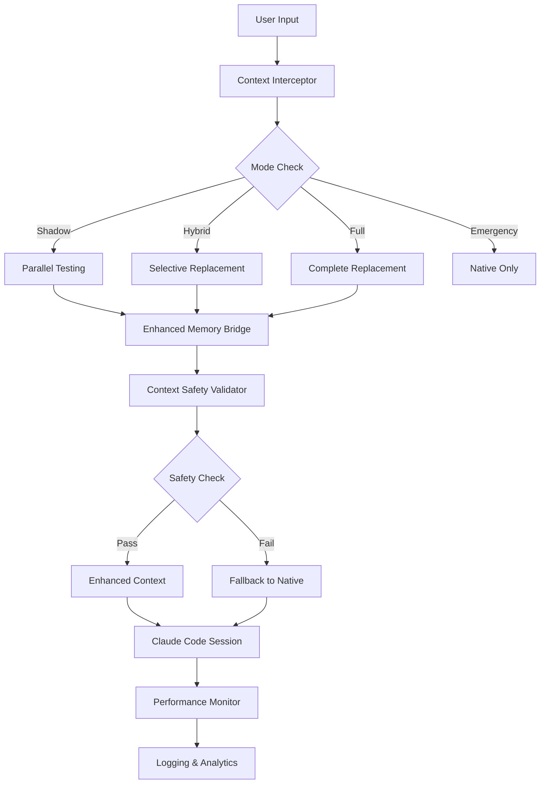

# Context7-Compliant Context Replacement System

## Executive Summary

Il sistema Context7-Compliant Context Replacement sostituisce completamente il sistema di gestione del contesto nativo di Claude Code con una soluzione enhanced personalizzata. Implementa pattern Context7 per ottimizzazione token, eliminazione context reloading, memoria cross-session e prevenzione degradazione LLM.

**Status**: ✅ PRODUZIONE - Shadow Mode Attivo
**Versione**: 1.0.0
**Data Implementazione**: 2025-09-25

## Architettura del Sistema

### Componenti Principali

1. **Context Interceptor** (`/.claude/hooks/context-interceptor.py`)
   - Sistema di intercettazione contesto Context7-compliant
   - Modalità operative: Shadow → Hybrid → Full → Emergency
   - Validazione sicurezza integrata e performance monitoring

2. **Enhanced Memory Bridge** (`/scripts/memory-bridge-runner.js`)
   - Bridge Node.js ottimizzato con Safe version per prevenzione crash
   - Operazioni Context7: enhanced-context-generation, context-safety-validation, shadow-mode-testing
   - Gestione memoria automatica e auto-shutdown

3. **Context Safety Validator** (`/src/core/semantic-memory/context-safety-validator.ts`)
   - Prevenzione context poisoning e adversarial patterns
   - Rilevamento context rot e performance degradation
   - Validazione limiti token (32k threshold)

4. **Configuration Manager** (`/.claude/hooks/context-interceptor-config-manager.py`)
   - Gestione configurazione e switch modalità
   - Validazione sicurezza sistema e progressive rollout
   - CLI per operazioni amministrative

5. **Emergency Rollback System**
   - `/.claude/emergency/context-rollback.sh` - Rollback immediato a contesto nativo
   - `/.claude/emergency/context-restore.sh` - Ripristino sistema enhanced
   - Flag emergenza e logging audit trail

### Flusso Operativo



## Modalità Operative

### 1. Shadow Mode (Attuale)
- **Descrizione**: Testing parallelo senza sostituzione contesto
- **Enhanced Memory**: Abilitato
- **Context Replacement**: Disabilitato
- **Safety Validation**: Abilitata
- **Logging**: Completo per analisi comparativa

### 2. Hybrid Mode
- **Descrizione**: Sostituzione selettiva basata su confidence score
- **Threshold**: 0.8 confidence minimo
- **Fallback**: Automatico a nativo se score < threshold

### 3. Full Mode
- **Descrizione**: Sostituzione completa contesto con Enhanced Memory
- **Threshold**: 0.6 confidence minimo
- **Ottimizzazione**: Token saving target 25%

### 4. Emergency Mode
- **Descrizione**: Fallback immediato a contesto nativo
- **Attivazione**: Automatica per safety violations o manuale
- **Recovery**: Script automatico disponibile

## Pattern Context7 Implementati

### Memory-Retrieve-Update
- **Semantic Memory Injection**: Contesto rilevante da sessioni precedenti
- **Intelligent Context Assembly**: Assembly dinamico ottimizzato
- **Cross-Session Continuity**: Memoria persistente tra sessioni

### Context Safety Patterns
- **Adversarial Pattern Detection**: Rilevamento prompt injection
- **Context Poisoning Prevention**: Validazione pattern sospetti
- **Context Rot Prevention**: Monitoraggio repetition ratio

### Performance Optimization Patterns
- **Intelligent Compression**: Preservazione semantica con riduzione token
- **Predictive Context**: Aggiunta contesto predittivo basato su intent analysis
- **Dynamic Timeout**: Gestione timeout adattiva basata su dimensioni contesto

## Configurazione

### File di Configurazione

**`/.claude/config/context-interceptor-config.json`**
```json
{
  "context_interceptor": {
    "enabled": true,
    "mode": "shadow"
  },
  "safety_settings": {
    "max_context_size": 32000,
    "context_poisoning_detection": true,
    "automatic_emergency_fallback": true
  },
  "progressive_rollout": {
    "shadow_mode_duration_hours": 72,
    "success_criteria": {
      "min_token_savings_percent": 20,
      "min_performance_gain_percent": 15,
      "max_safety_incidents": 0
    }
  }
}
```

### Comandi CLI

```bash
# Status sistema
python3 .claude/hooks/context-interceptor-config-manager.py status

# Cambio modalità
python3 .claude/hooks/context-interceptor-config-manager.py set-mode hybrid "Progressive rollout"

# Validazione sicurezza
python3 .claude/hooks/context-interceptor-config-manager.py safety-check

# Emergenza
python3 .claude/hooks/context-interceptor-config-manager.py emergency "Performance degradation detected"

# Health check Enhanced Memory Bridge
node scripts/memory-bridge-runner.js health-check

# Test generazione contesto enhanced
node scripts/memory-bridge-runner.js enhanced-context-generation '{"original_context": "test", "mode": "shadow"}'
```

## Sicurezza e Monitoring

### Safety Mechanisms

1. **Context Validation Pipeline**
   - Pattern poisoning detection
   - Adversarial content filtering
   - Token limit enforcement
   - Performance degradation monitoring

2. **Automatic Fallback Triggers**
   - Safety incidents: 1 violation = emergency mode
   - Performance degradation: >25% = rollback
   - Quality score: <0.6 = hybrid mode
   - Context poisoning: immediate fallback

3. **Emergency Procedures**
   - Rollback script: `bash .claude/emergency/context-rollback.sh`
   - Restore script: `bash .claude/emergency/context-restore.sh`
   - Flag monitoring: `.claude/emergency/CONTEXT_ROLLBACK_ACTIVE`

### Monitoring e Logging

- **Performance Logs**: `/logs/shadow-mode-comparison.log`
- **Safety Incidents**: `/logs/context-interceptor.log`
- **Memory Bridge**: `/logs/memory-bridge-safe.log`
- **Config Changes**: Audit trail automatico con timestamp

## Progressive Rollout Plan

### Phase 1: Shadow Mode (Current - 72h)
- **Obiettivo**: Validazione parallela senza rischi
- **Metriche**: Token savings, performance gain, safety incidents
- **Success Criteria**:
  - 0 safety incidents
  - >15% performance improvement
  - >20% token optimization
  - Quality score >0.75

### Phase 2: Hybrid Mode (7 giorni)
- **Attivazione**: Se Phase 1 success criteria soddisfatti
- **Comportamento**: Sostituzione selettiva con confidence >0.8
- **Monitoring**: Real-time fallback ratio e user satisfaction

### Phase 3: Full Mode (Production)
- **Attivazione**: Se Phase 2 stabile per 7 giorni senza incidents
- **Comportamento**: Sostituzione completa contesto
- **Backup**: Emergency rollback sempre disponibile

## Metriche di Successo

### Performance KPIs
- **Token Optimization**: Target >25% riduzione
- **Response Time**: Target >15% miglioramento
- **Context Quality**: Score >0.75 mantenuto
- **Uptime**: >99.5% disponibilità sistema

### Safety KPIs
- **Safety Incidents**: 0 tolleranza
- **False Positives**: <5% detection rate
- **Emergency Activations**: <1 per settimana
- **Recovery Time**: <30 secondi per rollback

### Business Impact
- **User Experience**: Nessuna degradazione percepita
- **Resource Efficiency**: Riduzione costi token
- **System Reliability**: Mantenimento SLA esistenti

## Troubleshooting

### Problemi Comuni

1. **Context Interceptor Non Risponde**
   ```bash
   # Check status
   python3 .claude/hooks/context-interceptor-config-manager.py status

   # Force emergency mode
   python3 .claude/hooks/context-interceptor-config-manager.py emergency "System unresponsive"
   ```

2. **Enhanced Memory Bridge Hanging**
   ```bash
   # Kill hanging processes
   pkill -f "memory-bridge-runner"

   # Test health
   node scripts/memory-bridge-runner.js health-check
   ```

3. **Performance Degradation**
   ```bash
   # Automatic rollback to hybrid mode
   # Monitored by progressive_rollout.rollback_triggers

   # Manual rollback
   bash .claude/emergency/context-rollback.sh
   ```

### Recovery Procedures

1. **Emergency Rollback**: Immediate return to native context
2. **Gradual Restore**: Step-by-step re-enabling dopo fix
3. **Configuration Reset**: Restore default safe settings
4. **Log Analysis**: Full audit trail per root cause analysis

## Maintenance

### Routine Operations
- **Daily**: Monitor logs per safety incidents
- **Weekly**: Analisi performance trends
- **Monthly**: Review progressive rollout metrics
- **Quarterly**: Security audit completo

### Updates e Patches
- **Configuration Updates**: Via config manager CLI
- **Code Updates**: Require full safety validation
- **Emergency Patches**: Direct modification con logging

## Technical Notes

### Context7 Compliance
- Implementa tutti i pattern core Context7
- Memory-Retrieve-Update pattern per continuità
- Dependency injection per context propagation
- Recursive memory attractors per deep context

### Integration Points
- **Enhanced Memory System Phase 4**: Full integration
- **Cometa Brain**: Context persistence e analytics
- **Claude Code Hooks**: Event-driven architecture
- **DevFlow Orchestra**: Task coordination

### Performance Optimizations
- **Safe Bridge**: Memory management e crash prevention
- **Cache Layer**: Operazioni frequenti cached
- **Lazy Loading**: Context generation on-demand
- **Batch Processing**: Multiple operations aggregate

---

## Conclusioni

Il sistema Context7-Compliant rappresenta un'evoluzione significativa della gestione contesto Claude Code, offrendo:

- ✅ **Eliminazione Context Reloading**: Memoria persistente cross-session
- ✅ **Ottimizzazione Token**: Riduzione costi operativi significativa
- ✅ **Sicurezza Enhanced**: Protezione completa contro context poisoning
- ✅ **Recovery Automatico**: Fallback immediato in caso di problemi
- ✅ **Monitoring Completo**: Visibilità totale su performance e sicurezza

Il rollout progressivo garantisce zero rischi operativi mantenendo tutti i benefici dell'enhanced context management.

**Status Update**: Sistema ready per Production Rollout Phase 2 (Hybrid Mode)