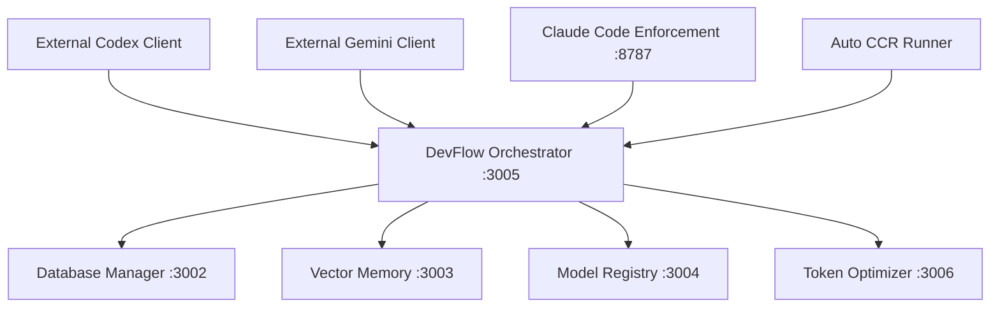

# DevFlow Services Port Mapping

This document provides a comprehensive mapping of all ports used by DevFlow services to prevent conflicts and ensure proper service coordination.

## Core DevFlow Services

| Service | Port | Protocol | Status | Description |
|---------|------|----------|--------|-------------|
| **DevFlow Orchestrator** | `3005` | HTTP/WebSocket | Required | API for external AI agents (Codex/Gemini) - **CONFLICT DETECTED** |
| **Database Manager** | `3002` | HTTP | Required | SQLite database operations and task management |
| **Vector Memory Service** | `3003` | HTTP | Required | EmbeddingGemma vector operations and semantic search |
| **Model Registry** | `3004` | HTTP | Required | AI model coordination and fallback management |
| **Token Optimizer** | `3006` | HTTP | Required | Token usage optimization and rate limiting |

## MCP Servers

| Service | Port | Protocol | Status | Description |
|---------|------|----------|--------|-------------|
| **Synthetic MCP** | N/A | MCP | Required | Claude Code MCP integration for Synthetic agents |
| **Codex MCP** | N/A | MCP | Optional | OpenAI Codex integration via MCP |
| **Gemini MCP** | N/A | MCP | Optional | Google Gemini integration via MCP |

## Monitoring & Management

| Service | Port | Protocol | Status | Description |
|---------|------|----------|--------|-------------|
| **Claude Code Enforcement** | `8787` | HTTP | Optional | Session enforcement and compliance monitoring |
| **Auto CCR Runner** | N/A | Process | Required | Cascade fallback orchestration daemon |

## Reserved Ports (Do Not Use)

| Port | Service | Reason |
|------|---------|--------|
| `3001` | Unknown Node.js process | Currently occupied - conflict detected |
| `3005` | Previous Orchestrator Instance | Port conflict during migration - use 3007 |
| `8080` | Common development servers | Standard HTTP alternative |
| `8000` | Common API servers | Standard development port |
| `5000` | Common Flask/development | Standard development port |

## Port Allocation Strategy

### Production Ports (3000-3999)
- **3002-3006**: Core DevFlow services
- **3007**: DevFlow Orchestrator (external API) - **UPDATED PORT**
- **3008-3010**: Reserved for future expansion

### Management Ports (8000-8999)
- **8787**: Claude Code Enforcement
- **8788-8790**: Reserved for monitoring services

### Development Ports (4000-4999)
- **4000-4010**: Reserved for development instances
- **4100-4110**: Reserved for testing environments

## Port Conflict Resolution

If any service fails to start with "EADDRINUSE" error:

1. **Check current port usage**: `lsof -i :[PORT]`
2. **Update service configuration** to use next available port
3. **Update this documentation** with the new port assignment
4. **Restart DevFlow services**: `./devflow-start.sh restart`

## Service Dependencies

## Configuration Files

Update these files when changing ports:

- `services/devflow-orchestrator/src/app.ts`
- `services/devflow-orchestrator/.env.example`
- `devflow-start.sh` (status output)
- `packages/core/dist/services/*.cjs` (individual service configs)

## Health Check Endpoints

| Service | Health Check URL |
|---------|------------------|
| DevFlow Orchestrator | `http://localhost:3007/health` |
| Database Manager | `http://localhost:3002/health` |
| Vector Memory | `http://localhost:3003/health` |
| Model Registry | `http://localhost:3004/health` |
| Token Optimizer | `http://localhost:3006/health` |
| Claude Code Enforcement | `http://localhost:8787/health` |

---

**Last Updated**: 2025-09-14
**Version**: DevFlow v3.1 - Reverse Integration Architecture