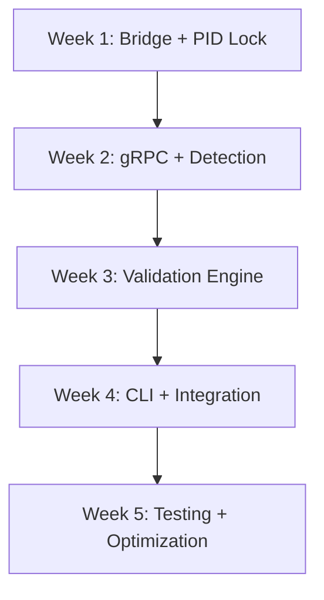

# DevFlow Cometa Task: REAL cc-tools Integration

## Task ID: DEVFLOW-CC-TOOLS-REAL-INTEGRATION-001

## Overview
This task outlines the comprehensive integration of cc-tools into the REAL project infrastructure, replacing legacy Claude Code hooks with a modern, scalable architecture that includes parallel validation execution, intelligent project detection, and robust CLI management.

## Project Structure
```
REAL/
├── cc-tools/
│   ├── bridge/
│   │   ├── go_python_bridge.go
│   │   └── bridge_interface.py
│   ├── validation/
│   │   ├── parallel_executor.py
│   │   └── validation_engine.go
│   ├── detection/
│   │   ├── project_classifier.py
│   │   └── detection_engine.go
│   ├── cli/
│   │   ├── command_handler.py
│   │   └── cli_manager.go
│   └── core/
│       ├── pid_lock.go
│       └── mcp_integration.py
└── docs/
    └── cc-tools-integration.md
```

## Micro-Tasks Breakdown

### 1. Go/Python Bridge Implementation
**Agent**: Codex Senior Dev
**Dependencies**: None
**Estimated Time**: 3 days

#### Subtasks:
- [ ] Create Go-Python cgo bridge for inter-language communication
- [ ] Implement shared memory structures for data exchange
- [ ] Develop error handling and serialization protocols
- [ ] Create unit tests for bridge components

#### Deliverables:
- `cc-tools/bridge/go_python_bridge.go`
- `cc-tools/bridge/bridge_interface.py`
- Bridge documentation in `docs/cc-tools-integration.md`

### 2. Claude Code Hooks Replacement
**Agent**: Claude Tech Lead
**Dependencies**: Go/Python Bridge
**Estimated Time**: 4 days

#### Subtasks:
- [ ] Design gRPC service definitions for cc-tools
- [ ] Implement service handlers in Go
- [ ] Create Python client wrappers
- [ ] Migrate existing hook functionality
- [ ] Performance benchmarking

#### Deliverables:
- `cc-tools/core/grpc_services.proto`
- `cc-tools/core/service_handlers.go`
- `cc-tools/core/client_wrappers.py`

### 3. Parallel Validation Execution Engine
**Agent**: Codex Senior Dev
**Dependencies**: Claude Code Hooks Replacement
**Estimated Time**: 5 days

#### Subtasks:
- [ ] Design concurrent validation pipeline
- [ ] Implement worker pool pattern in Python
- [ ] Create Go coordination service
- [ ] Add configurable parallelism settings
- [ ] Integration with MCP (Model Coordination Protocol)

#### Deliverables:
- `cc-tools/validation/parallel_executor.py`
- `cc-tools/validation/validation_engine.go`
- MCP integration module `cc-tools/core/mcp_integration.py`

### 4. PID Locking Mechanism
**Agent**: Claude Tech Lead
**Dependencies**: None
**Estimated Time**: 2 days

#### Subtasks:
- [ ] Implement cross-platform PID file management
- [ ] Add lock acquisition and release mechanisms
- [ ] Create deadlock detection and recovery
- [ ] Process cleanup on termination

#### Deliverables:
- `cc-tools/core/pid_lock.go`
- Process management documentation

### 5. Project Detection Classifier
**Agent**: Gemini Doc Manager
**Dependencies**: None
**Estimated Time**: 4 days

#### Subtasks:
- [ ] Train project type classifier model
- [ ] Implement detection algorithm in Python
- [ ] Create Go wrapper for classifier
- [ ] Integrate with existing project analysis tools
- [ ] Documentation of classification criteria

#### Deliverables:
- `cc-tools/detection/project_classifier.py`
- `cc-tools/detection/detection_engine.go`
- Classification model and documentation

### 6. CLI Management System
**Agent**: Synthetic
**Dependencies**: All previous components
**Estimated Time**: 3 days

#### Subtasks:
- [ ] Design command-line interface structure
- [ ] Implement command routing and parsing
- [ ] Create help and documentation system
- [ ] Add autocomplete support
- [ ] Integration testing

#### Deliverables:
- `cc-tools/cli/command_handler.py`
- `cc-tools/cli/cli_manager.go`
- CLI user guide

## Agent Assignments

| Agent | Role | Responsibilities |
|-------|------|------------------|
| Claude | Tech Lead | gRPC design, architecture oversight, PID locking |
| Codex | Senior Dev | Parallel execution, MCP integration, bridge implementation |
| Gemini | Doc Manager | Project detection classifier, technical documentation |
| Qwen | QA Specialist | Validation tests, performance optimization, quality assurance |
| Synthetic | CLI Developer | Command-line interface, user experience |

## Intelligent Batching Strategy

### Batch Formation Rules:
1. **Priority-based grouping**: High-priority validations execute first
2. **Resource-aware scheduling**: CPU/Memory usage monitored for optimal batch size
3. **Dependency resolution**: Inter-project dependencies maintained within batches
4. **Time-window allocation**: 15-minute batch execution windows

### Dynamic Adjustment:
- Monitor system load and adjust batch sizes accordingly
- Implement backpressure when system is overloaded
- Prioritize based on project criticality and deadlines

## Timeline



### Week 1 (May 6-10)
- Go/Python bridge implementation
- PID locking mechanism
- Initial project setup

### Week 2 (May 13-17)
- gRPC service design and implementation
- Project detection classifier
- Documentation foundation

### Week 3 (May 20-24)
- Parallel validation engine
- MCP integration
- Unit testing

### Week 4 (May 27-31)
- CLI management system
- Component integration
- Interface design

### Week 5 (June 3-7)
- System testing
- Performance optimization
- Final documentation
- Deployment preparation

## Risk Mitigation

### Technical Risks:
1. **Bridge performance bottlenecks**
   - Mitigation: Implement asynchronous communication
   - Contingency: Fallback to file-based exchange

2. **gRPC compatibility issues**
   - Mitigation: Version compatibility testing
   - Contingency: REST API backup implementation

3. **Parallel execution race conditions**
   - Mitigation: Comprehensive locking strategy
   - Contingency: Sequential fallback mode

### Schedule Risks:
1. **Classifier training delays**
   - Mitigation: Use pre-trained models initially
   - Contingency: Rule-based detection as interim solution

2. **Integration complexities**
   - Mitigation: Incremental integration approach
   - Contingency: Extended integration period

## Quality Assurance

### Testing Strategy:
- Unit tests for each micro-task component (>90% coverage)
- Integration tests for cross-component functionality
- Performance benchmarks for validation engine
- End-to-end CLI workflow testing

### Qwen's Validation Responsibilities:
- [ ] Create test suite for bridge communication
- [ ] Validate parallel execution correctness
- [ ] Benchmark performance improvements
- [ ] Verify PID locking reliability
- [ ] Test project detection accuracy
- [ ] CLI command validation

## Production Deployment Plan

### Phase 1: Staging Environment (June 10-14)
- Deploy to staging with sample projects
- Monitor resource usage and performance
- Validate all integration points
- Conduct security review

### Phase 2: Gradual Rollout (June 17-21)
- Deploy to 25% of development teams
- Collect feedback and metrics
- Address any issues
- Performance tuning

### Phase 3: Full Deployment (June 24-28)
- Complete rollout to all teams
- Decommission legacy Claude Code hooks
- Monitor system stability
- Document lessons learned

## Success Metrics

1. **Performance**: 50% reduction in validation time
2. **Reliability**: 99.9% uptime for cc-tools services
3. **Adoption**: 100% of projects using new system within 30 days
4. **Resource Efficiency**: 30% improvement in CPU utilization
5. **Developer Satisfaction**: >4.5/5 rating in team feedback

## Documentation Deliverables

1. **Technical Architecture Document** (Gemini)
2. **User Guide for CLI** (Synthetic)
3. **Integration Guide** (Claude)
4. **API Documentation** (Codex)
5. **Project Detection Model Documentation** (Gemini)

## Approval

**Tech Lead**: _____________________  **Date**: _________
**Product Manager**: _____________________  **Date**: _________
**QA Lead**: _____________________  **Date**: _________

---
*This task is managed by DevFlow Cometa v3.1*
